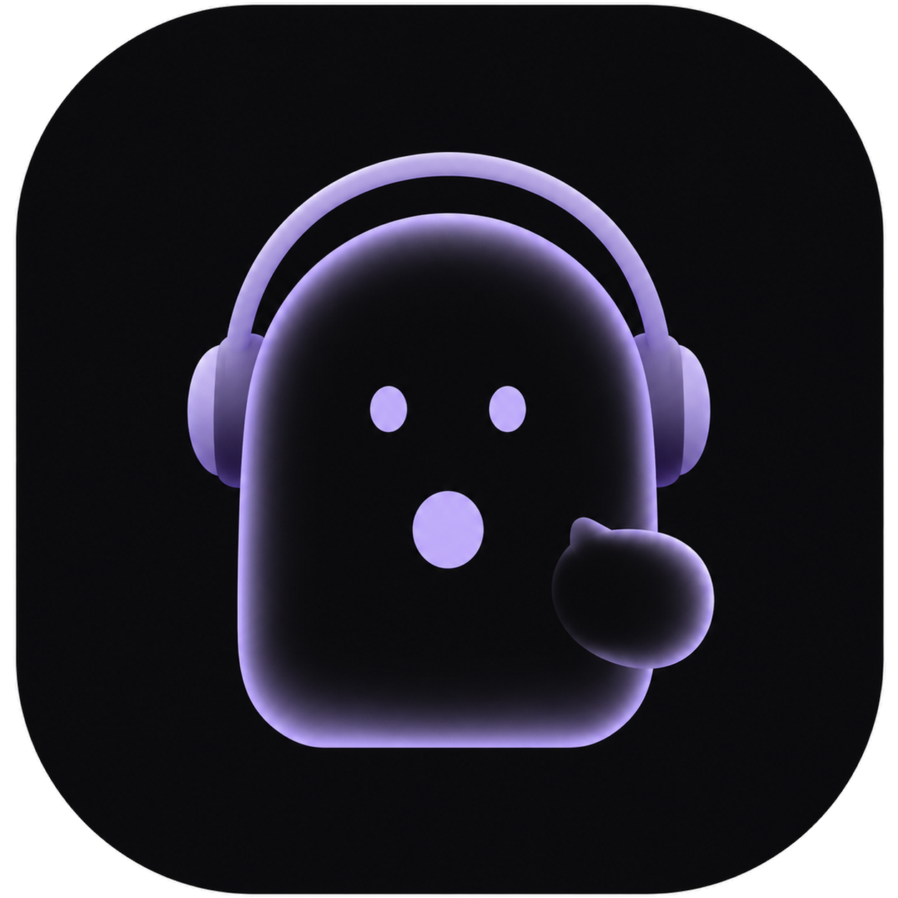
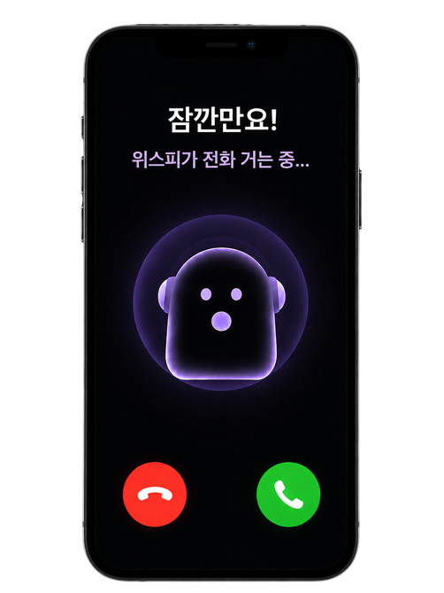
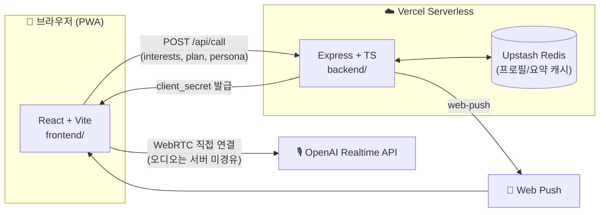

<div align="center">



# 👻 위스피 (Wispy)

### _"잠깐만요! 화면에 빠진 당신을, 위스피가 전화로 불러낼게요."_

AI가 **진짜 전화**로 개입해 스마트폰 중독을 끊어주는 서비스

[](frontend)
[](frontend)
[](backend)
[](backend)
[](https://platform.openai.com/docs/guides/realtime)
[](frontend/public/manifest.webmanifest)
[](https://vercel.com)

</div>

<br />

<div align="center">
  
</div>

<br />

## 👻 위스피가 뭔가요?

인스타그램, 유튜브, 틱톡… 정신 차려보면 30분, 1시간이 훌쩍 지나 있던 경험, 다들 있으실 거예요.

**위스피**는 알림이나 팝업으로 "그만 보세요"라고 다그치지 않아요. 대신 설정해둔 시간이 지나면 **정말로 전화를 걸어** 옵니다. 화면을 스크롤하던 손가락이, 벨소리 앞에서는 멈추니까요.

- 📞 통화 화면엔 "잠깐만" 같은 서비스 이름이 아니라 **위스피라는 이름**이 뜹니다. 아는 사람이 건 전화처럼요.
- 🗣️ 통화는 미리 입력해둔 **관심사**와 **오늘의 할 일**을 바탕으로, OpenAI Realtime API가 **실시간 음성**으로 자연스럽게 이어갑니다.
- 🧠 지난 통화 요약을 기억해뒀다가 다음 통화에서 "저번에 말했던 그거 어떻게 됐어?"처럼 슬쩍 되짚어줍니다.
- 🔔 화면에서 눈을 못 뗄 땐 실제 **PWA 웹 푸시**로 친구가 보낸 듯한 문자를 보냅니다.

## ✨ 주요 기능

| 기능 | 설명 |
| --- | --- |
| 📱 **앱 모니터링** | 인스타그램 · 유튜브 · 틱톡 · 카카오톡 · X · 넷플릭스 등 앱별로 사용 시간 제한을 설정 |
| ☎️ **AI 실시간 전화 개입** | 제한 시간을 넘기면 위스피가 OpenAI Realtime API(WebRTC)로 실제 음성 통화를 걸어옴 |
| 👻 **위스피 페르소나** | "곁에 있는 동반자" 컨셉의 캐릭터가 편안한 존댓말로 대화 |
| 🧵 **DB 없는 개인화** | 로그인 없이 `localStorage` + 서버 KV로 관심사 · 할 일 · 이전 통화 요약을 반영 |
| 🔔 **PWA Web Push** | 홈 화면 설치 + 실제 푸시 알림으로 화면 밖에서도 개입 |
| 📊 **주간 리포트** | 개입 횟수, 평균 통화 시간, 앱별 사용 비중을 한눈에 확인 |

## 🏗️ 아키텍처



> 통화 음성 스트림은 **브라우저가 OpenAI와 직접** WebRTC로 주고받습니다. 백엔드는 짧은 토큰 발급 · 프로필 저장 · 푸시 발송만 담당하는 stateless 서버라 Vercel Hobby 플랜으로도 충분합니다.

## 🧰 기술 스택

<table>
<tr>
<td valign="top" width="50%">

**Frontend** (`frontend/`)
- React 19 + Vite 8
- Tailwind CSS 4
- PWA (Service Worker, Web Push)
- OpenAI Realtime API (WebRTC)

</td>
<td valign="top" width="50%">

**Backend** (`backend/`)
- Express + TypeScript
- Vercel Serverless Functions
- Upstash Redis (KV)
- `web-push`, Swagger UI

</td>
</tr>
</table>

## 🚀 시작하기

### 1. 저장소 클론

```bash
git clone https://github.com/hjdd0309/WAS.git
cd WAS
```

### 2. 백엔드 (`backend/`)

```bash
cd backend
npm install
cp .env.example .env   # OPENAI_API_KEY 채우기
npm run dev
```

- API: `http://localhost:3000/api/call`
- Swagger UI: `http://localhost:3000/docs`
- 헬스체크: `http://localhost:3000/health`

### 3. 프론트엔드 (`frontend/`)

```bash
cd frontend
npm install
npm run dev
```

자세한 API 스펙과 환경 변수는 각 폴더의 README를 참고하세요 — [`backend/README.md`](backend/README.md) · [`backend/CLAUDE.md`](backend/CLAUDE.md)

## 📁 프로젝트 구조

```
WAS-Wait-A-Second-/
├── frontend/        # React PWA — 온보딩, 홈, 통화 화면, 리포트
│   └── src/
│       ├── pages/       # Home, Report, Log, Onboarding, Call, ...
│       ├── components/  # BottomNav, TagInput, WeeklyBars, ...
│       ├── assets/       # 위스피 일러스트, 앱 아이콘
│       └── personas.js  # 위스피 페르소나 정의
└── backend/          # Express + TS — Realtime 토큰 발급, 프로필, 푸시
    └── src/
        ├── app.ts        # Express 라우트 구성
        ├── personas.ts   # 페르소나별 voice/system instructions
        ├── kv.ts         # Upstash Redis 프로필 저장
        └── notificationText.ts  # 푸시 문구 생성
```

## 🔒 보안

- CORS 화이트리스트 + 공유 시크릿(`x-app-secret`)으로 `/api/call` 스캐너 방지
- IP당 분당 10회 rate limit으로 세션 발급 남용 방지
- `interests` · `plan` 입력 길이 제한으로 프롬프트 인젝션 방지

자세한 내용은 [`backend/README.md`](backend/README.md#보안-메모) 참고.

---

<div align="center">

_정신없이 흐르던 화면, 위스피랑 잠깐 다른 얘기 해볼까요?_ 👻

</div>
